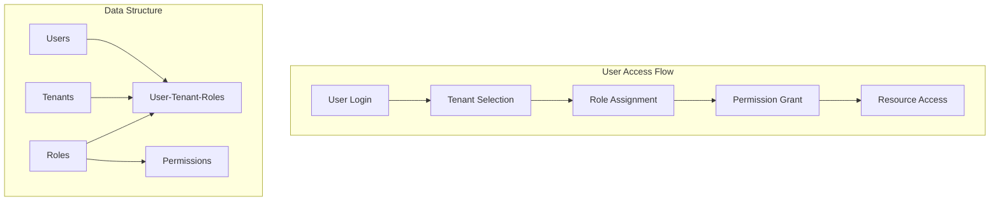
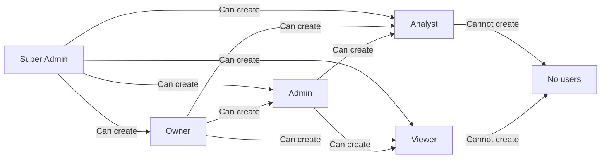

# Multi-Tenant RBAC System - Executive Summary

## Overview

This document presents a comprehensive multi-tenant Role-Based Access Control (RBAC) system designed to provide secure, scalable, and flexible access management across multiple tenants in the RevSoc platform.

## Key Features

### 1. **Multi-Tenant Architecture**
- Users can belong to multiple tenants simultaneously
- Each user can have different roles in different tenants
- Seamless tenant switching without re-authentication
- Complete data isolation between tenants

### 2. **5-Level Role Hierarchy**
- **Super Admin** (Level 1): Platform-wide control
- **Owner** (Level 2): Full tenant control
- **Admin** (Level 3): Tenant management
- **Analyst** (Level 4): Data analysis and reporting
- **Viewer** (Level 5): Read-only access

### 3. **Granular Permission System**
- Role-based permissions
- Tenant-scoped access control
- Hierarchical permission inheritance
- Audit trail for all actions

## System Architecture

## Core Workflows

### 1. User Authentication & Tenant Selection

| Step | Action | Result |
|------|--------|--------|
| 1 | User logs in with credentials | Authentication token generated |
| 2 | System fetches user's assigned tenants | List of available tenants |
| 3 | User selects or auto-selects tenant | Tenant context established |
| 4 | System loads tenant-specific role | Permissions activated |
| 5 | User accesses tenant resources | Role-based access enforced |

### 2. Role-Based Access Control

| Role | Can Create Users | Can Manage Tenants | Can Access Data | Can Configure |
|------|-----------------|-------------------|-----------------|---------------|
| Super Admin | All roles, any tenant | Create, modify, delete | All tenants | Everything |
| Owner | Admin, Analyst, Viewer | Modify own tenant | Own tenant | Own tenant |
| Admin | Analyst, Viewer | View only | Own tenant | Own tenant |
| Analyst | Cannot create | View only | View & analyze | View only |
| Viewer | Cannot create | View only | View only | No access |

### 3. User Management Permissions

## Database Schema Overview

### Core Tables

| Table | Purpose | Key Fields |
|-------|---------|------------|
| `users` | User accounts | id, email, username, is_super_admin |
| `tenants` | Tenant organizations | id, tenant_code, tenant_name, status |
| `roles` | System roles | id, role_name, level, scope |
| `user_tenant_roles` | User-tenant mappings | user_id, tenant_id, role_id |
| `permissions` | Granular permissions | id, permission_name, resource, action |
| `audit_logs` | Activity tracking | action, user_id, tenant_id, timestamp |

### Key Relationships

1. **Users ↔ Tenants**: Many-to-many through `user_tenant_roles`
2. **Users ↔ Roles**: One role per user per tenant
3. **Roles ↔ Permissions**: Many-to-many relationship
4. **All Actions → Audit Logs**: Complete audit trail

## Security Features

### 1. **Access Control**
- JWT-based authentication with tenant context
- Permission verification at API level
- Frontend permission gates
- Role hierarchy enforcement

### 2. **Data Protection**
- Complete tenant data isolation
- Row-level security in database
- Encrypted authentication tokens
- Secure session management

### 3. **Audit & Compliance**
- All actions logged with user, timestamp, and tenant
- Immutable audit trail
- Export capabilities for compliance
- Real-time monitoring support

## Implementation Benefits

### 1. **Scalability**
- Supports unlimited tenants
- Efficient permission checking
- Optimized database queries
- Minimal performance overhead

### 2. **Flexibility**
- Easy to add new roles
- Customizable permissions
- Tenant-specific configurations
- Extensible architecture

### 3. **User Experience**
- Seamless tenant switching
- Clear role indicators
- Intuitive permission model
- Consistent UI/UX

### 4. **Administration**
- Centralized user management
- Bulk operations support
- Self-service capabilities
- Comprehensive reporting

## Key Metrics & Constraints

| Metric | Value | Notes |
|--------|-------|-------|
| Max roles per system | Unlimited | 5 default roles provided |
| Max tenants per user | Unlimited | Typically 1-10 |
| Max users per tenant | Unlimited | Based on plan |
| Permission check time | <10ms | Cached for performance |
| Audit retention | Configurable | Default 90 days |
| Token expiry | 24 hours | Configurable |

## Risk Mitigation

| Risk | Mitigation Strategy |
|------|-------------------|
| Privilege escalation | Role hierarchy enforcement, audit logging |
| Data leakage | Tenant isolation, permission checks |
| Unauthorized access | JWT validation, session management |
| Audit tampering | Immutable logs, separate storage |
| Performance impact | Caching, optimized queries |

## Implementation Roadmap

### Phase 1: Foundation (Week 1-2)
- Database schema implementation
- Basic authentication service
- Role and permission setup

### Phase 2: Core Features (Week 3-4)
- User-tenant assignment
- Tenant switching functionality
- Permission middleware

### Phase 3: UI Implementation (Week 5-6)
- Tenant switcher component
- Permission-based UI elements
- User management interface

### Phase 4: Security & Polish (Week 7-8)
- Audit logging system
- Performance optimization
- Security testing

### Phase 5: Deployment (Week 9)
- Production deployment
- Monitoring setup
- Documentation completion

## Cost-Benefit Analysis

### Benefits
- **Enhanced Security**: Role-based access prevents unauthorized actions
- **Improved Efficiency**: Users manage multiple tenants from one account
- **Better Compliance**: Complete audit trail for all activities
- **Scalable Growth**: Architecture supports unlimited expansion
- **Reduced Support**: Self-service user management

### Investment Required
- **Development**: 8-9 weeks of engineering effort
- **Infrastructure**: Minimal additional requirements
- **Training**: 1-2 days for administrators
- **Maintenance**: Standard application maintenance

## Success Criteria

1. **Security**: Zero unauthorized access incidents
2. **Performance**: <100ms average response time
3. **Adoption**: 90% of users utilizing multi-tenant features
4. **Efficiency**: 50% reduction in user management tickets
5. **Compliance**: 100% audit coverage of sensitive operations

## Conclusion

The proposed multi-tenant RBAC system provides a robust, scalable, and secure foundation for managing user access across multiple tenants. The hierarchical role system, combined with granular permissions and comprehensive audit logging, ensures both flexibility and security for the growing needs of the RevSoc platform.

The implementation follows industry best practices and provides a clear upgrade path for future enhancements while maintaining backward compatibility with existing systems.