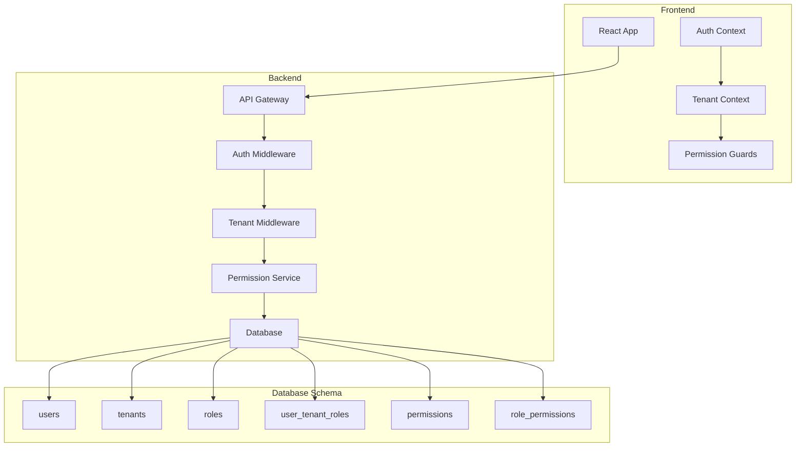

# Multi-Tenant RBAC Implementation Guide

## Overview
This guide provides a complete implementation roadmap for the multi-tenant RBAC system with proper role hierarchy, tenant switching, and permission management.

## Architecture Overview



## Phase 1: Database Schema Implementation

### 1.1 Core Tables

```sql
-- Users table (enhanced)
CREATE TABLE users (
    id UUID PRIMARY KEY DEFAULT gen_random_uuid(),
    email VARCHAR(255) UNIQUE NOT NULL,
    username VARCHAR(100) UNIQUE NOT NULL,
    first_name VARCHAR(100),
    last_name VARCHAR(100),
    password_hash VARCHAR(255),
    is_active BOOLEAN DEFAULT true,
    is_super_admin BOOLEAN DEFAULT false,
    created_at TIMESTAMP DEFAULT CURRENT_TIMESTAMP,
    updated_at TIMESTAMP DEFAULT CURRENT_TIMESTAMP,
    last_login_at TIMESTAMP,
    created_by UUID,
    FOREIGN KEY (created_by) REFERENCES users(id)
);

-- Tenants table
CREATE TABLE tenants (
    id UUID PRIMARY KEY DEFAULT gen_random_uuid(),
    tenant_code VARCHAR(50) UNIQUE NOT NULL,
    tenant_name VARCHAR(255) NOT NULL,
    description TEXT,
    status VARCHAR(20) DEFAULT 'active', -- active, suspended, pending_deletion
    created_at TIMESTAMP DEFAULT CURRENT_TIMESTAMP,
    updated_at TIMESTAMP DEFAULT CURRENT_TIMESTAMP,
    created_by UUID NOT NULL,
    settings JSONB DEFAULT '{}',
    FOREIGN KEY (created_by) REFERENCES users(id)
);

-- Roles table with hierarchy
CREATE TABLE roles (
    id UUID PRIMARY KEY DEFAULT gen_random_uuid(),
    role_name VARCHAR(50) NOT NULL,
    display_name VARCHAR(100) NOT NULL,
    description TEXT,
    level INTEGER NOT NULL, -- 1-5 hierarchy
    scope VARCHAR(20) NOT NULL, -- 'platform' or 'tenant'
    is_system_role BOOLEAN DEFAULT true,
    created_at TIMESTAMP DEFAULT CURRENT_TIMESTAMP,
    UNIQUE(role_name, scope)
);

-- User-Tenant-Roles mapping
CREATE TABLE user_tenant_roles (
    id UUID PRIMARY KEY DEFAULT gen_random_uuid(),
    user_id UUID NOT NULL,
    tenant_id UUID NOT NULL,
    role_id UUID NOT NULL,
    assigned_at TIMESTAMP DEFAULT CURRENT_TIMESTAMP,
    assigned_by UUID NOT NULL,
    is_active BOOLEAN DEFAULT true,
    expires_at TIMESTAMP,
    FOREIGN KEY (user_id) REFERENCES users(id) ON DELETE CASCADE,
    FOREIGN KEY (tenant_id) REFERENCES tenants(id) ON DELETE CASCADE,
    FOREIGN KEY (role_id) REFERENCES roles(id),
    FOREIGN KEY (assigned_by) REFERENCES users(id),
    UNIQUE(user_id, tenant_id, role_id)
);

-- Permissions table
CREATE TABLE permissions (
    id UUID PRIMARY KEY DEFAULT gen_random_uuid(),
    permission_name VARCHAR(100) UNIQUE NOT NULL,
    resource VARCHAR(50) NOT NULL,
    action VARCHAR(50) NOT NULL,
    description TEXT,
    created_at TIMESTAMP DEFAULT CURRENT_TIMESTAMP
);

-- Role-Permissions mapping
CREATE TABLE role_permissions (
    id UUID PRIMARY KEY DEFAULT gen_random_uuid(),
    role_id UUID NOT NULL,
    permission_id UUID NOT NULL,
    FOREIGN KEY (role_id) REFERENCES roles(id) ON DELETE CASCADE,
    FOREIGN KEY (permission_id) REFERENCES permissions(id) ON DELETE CASCADE,
    UNIQUE(role_id, permission_id)
);

-- Audit logs
CREATE TABLE audit_logs (
    id UUID PRIMARY KEY DEFAULT gen_random_uuid(),
    action VARCHAR(100) NOT NULL,
    resource_type VARCHAR(50) NOT NULL,
    resource_id UUID,
    performed_by UUID NOT NULL,
    performed_at TIMESTAMP DEFAULT CURRENT_TIMESTAMP,
    tenant_id UUID,
    metadata JSONB DEFAULT '{}',
    ip_address INET,
    user_agent TEXT,
    FOREIGN KEY (performed_by) REFERENCES users(id),
    FOREIGN KEY (tenant_id) REFERENCES tenants(id)
);

-- Create indexes for performance
CREATE INDEX idx_user_tenant_roles_user ON user_tenant_roles(user_id);
CREATE INDEX idx_user_tenant_roles_tenant ON user_tenant_roles(tenant_id);
CREATE INDEX idx_audit_logs_tenant ON audit_logs(tenant_id);
CREATE INDEX idx_audit_logs_performed_by ON audit_logs(performed_by);
CREATE INDEX idx_audit_logs_performed_at ON audit_logs(performed_at);
```

### 1.2 Initial Data Seed

```sql
-- Insert system roles
INSERT INTO roles (role_name, display_name, description, level, scope) VALUES
('super_admin', 'Super Admin', 'Platform administrator with full access', 1, 'platform'),
('owner', 'Owner', 'Tenant owner with full tenant control', 2, 'tenant'),
('admin', 'Admin', 'Tenant administrator', 3, 'tenant'),
('analyst', 'Analyst', 'Data analyst with read and analyze permissions', 4, 'tenant'),
('viewer', 'Viewer', 'Read-only access', 5, 'tenant');

-- Insert base permissions
INSERT INTO permissions (permission_name, resource, action) VALUES
-- Tenant permissions
('TENANT_CREATE', 'tenant', 'create'),
('TENANT_UPDATE', 'tenant', 'update'),
('TENANT_DELETE', 'tenant', 'delete'),
('TENANT_VIEW', 'tenant', 'view'),
-- User permissions
('USER_CREATE', 'user', 'create'),
('USER_UPDATE', 'user', 'update'),
('USER_DELETE', 'user', 'delete'),
('USER_VIEW', 'user', 'view'),
('USER_ASSIGN_ROLE', 'user', 'assign_role'),
-- Data permissions
('DATA_VIEW', 'data', 'view'),
('DATA_EXPORT', 'data', 'export'),
('DATA_MODIFY', 'data', 'modify'),
('DATA_DELETE', 'data', 'delete'),
-- Configuration permissions
('CONFIG_VIEW', 'config', 'view'),
('CONFIG_MODIFY', 'config', 'modify');

-- Assign permissions to roles
-- Super Admin gets all permissions
INSERT INTO role_permissions (role_id, permission_id)
SELECT r.id, p.id FROM roles r, permissions p WHERE r.role_name = 'super_admin';

-- Owner permissions
INSERT INTO role_permissions (role_id, permission_id)
SELECT r.id, p.id FROM roles r, permissions p 
WHERE r.role_name = 'owner' 
AND p.permission_name IN (
    'TENANT_UPDATE', 'TENANT_DELETE', 'TENANT_VIEW',
    'USER_CREATE', 'USER_UPDATE', 'USER_DELETE', 'USER_VIEW', 'USER_ASSIGN_ROLE',
    'DATA_VIEW', 'DATA_EXPORT', 'DATA_MODIFY', 'DATA_DELETE',
    'CONFIG_VIEW', 'CONFIG_MODIFY'
);

-- Admin permissions
INSERT INTO role_permissions (role_id, permission_id)
SELECT r.id, p.id FROM roles r, permissions p 
WHERE r.role_name = 'admin' 
AND p.permission_name IN (
    'TENANT_VIEW',
    'USER_CREATE', 'USER_UPDATE', 'USER_DELETE', 'USER_VIEW', 'USER_ASSIGN_ROLE',
    'DATA_VIEW', 'DATA_EXPORT', 'DATA_MODIFY',
    'CONFIG_VIEW', 'CONFIG_MODIFY'
);

-- Analyst permissions
INSERT INTO role_permissions (role_id, permission_id)
SELECT r.id, p.id FROM roles r, permissions p 
WHERE r.role_name = 'analyst' 
AND p.permission_name IN (
    'TENANT_VIEW',
    'USER_VIEW',
    'DATA_VIEW', 'DATA_EXPORT'
);

-- Viewer permissions
INSERT INTO role_permissions (role_id, permission_id)
SELECT r.id, p.id FROM roles r, permissions p 
WHERE r.role_name = 'viewer' 
AND p.permission_name IN (
    'TENANT_VIEW',
    'USER_VIEW',
    'DATA_VIEW'
);
```

## Phase 2: Backend Implementation

### 2.1 Updated Types and Interfaces

```typescript
// types/auth.types.ts
export interface User {
  id: string;
  email: string;
  username: string;
  firstName: string;
  lastName: string;
  isActive: boolean;
  isSuperAdmin: boolean;
  createdAt: Date;
  lastLoginAt?: Date;
}

export interface Role {
  id: string;
  roleName: string;
  displayName: string;
  description?: string;
  level: number;
  scope: 'platform' | 'tenant';
  permissions: Permission[];
}

export interface Permission {
  id: string;
  permissionName: string;
  resource: string;
  action: string;
}

export interface TenantAssignment {
  tenant: Tenant;
  role: Role;
  assignedAt: Date;
  assignedBy: string;
  isActive: boolean;
  expiresAt?: Date;
}

export interface AuthContext {
  user: User;
  currentTenant?: {
    id: string;
    name: string;
    code: string;
  };
  role?: Role;
  permissions: string[];
}
```

### 2.2 Authentication Service

```typescript
// services/auth.service.ts
import jwt from 'jsonwebtoken';
import bcrypt from 'bcrypt';

export class AuthService {
  async login(email: string, password: string): Promise<LoginResponse> {
    // Verify user credentials
    const user = await this.userRepository.findByEmail(email);
    if (!user || !await bcrypt.compare(password, user.passwordHash)) {
      throw new UnauthorizedException('Invalid credentials');
    }
    
    // Get user's tenant assignments
    const tenantAssignments = await this.getTenantAssignments(user.id);
    
    // Determine initial tenant
    let currentTenant = null;
    let currentRole = null;
    
    if (user.isSuperAdmin) {
      // Super admin doesn't need tenant context initially
      currentRole = await this.roleRepository.findByName('super_admin');
    } else if (tenantAssignments.length > 0) {
      // Use last accessed tenant or first available
      currentTenant = await this.determineInitialTenant(user.id, tenantAssignments);
      currentRole = tenantAssignments.find(
        ta => ta.tenant.id === currentTenant.id
      )?.role;
    }
    
    // Generate JWT
    const token = this.generateToken(user, currentTenant, currentRole);
    
    // Update last login
    await this.userRepository.updateLastLogin(user.id);
    
    // Create audit log
    await this.auditService.log({
      action: 'USER_LOGIN',
      performedBy: user.id,
      tenantId: currentTenant?.id,
      metadata: { method: 'password' }
    });
    
    return {
      token,
      user,
      currentTenant,
      availableTenants: tenantAssignments.map(ta => ta.tenant),
      permissions: currentRole?.permissions.map(p => p.permissionName) || []
    };
  }
  
  async switchTenant(userId: string, newTenantId: string): Promise<SwitchTenantResponse> {
    // Verify user has access to tenant
    const assignment = await this.userTenantRoleRepository.findOne({
      userId,
      tenantId: newTenantId,
      isActive: true
    });
    
    if (!assignment) {
      throw new ForbiddenException('No access to this tenant');
    }
    
    // Get user and tenant details
    const user = await this.userRepository.findById(userId);
    const tenant = await this.tenantRepository.findById(newTenantId);
    const role = await this.roleRepository.findById(assignment.roleId);
    
    // Generate new token with updated tenant context
    const token = this.generateToken(user, tenant, role);
    
    // Update user's last accessed tenant
    await this.userRepository.updateLastAccessedTenant(userId, newTenantId);
    
    // Audit log
    await this.auditService.log({
      action: 'TENANT_SWITCH',
      performedBy: userId,
      tenantId: newTenantId,
      metadata: { fromTenant: assignment.tenantId }
    });
    
    return {
      token,
      tenant,
      role,
      permissions: role.permissions.map(p => p.permissionName)
    };
  }
  
  private generateToken(user: User, tenant?: Tenant, role?: Role): string {
    const payload: JWTPayload = {
      userId: user.id,
      email: user.email,
      username: user.username,
      isSuperAdmin: user.isSuperAdmin,
      currentTenant: tenant ? {
        id: tenant.id,
        name: tenant.name,
        code: tenant.code
      } : null,
      role: role ? {
        id: role.id,
        name: role.roleName,
        level: role.level
      } : null,
      permissions: role?.permissions.map(p => p.permissionName) || [],
      iat: Date.now(),
      exp: Date.now() + (24 * 60 * 60 * 1000) // 24 hours
    };
    
    return jwt.sign(payload, process.env.JWT_SECRET);
  }
}
```

### 2.3 Middleware Implementation

```typescript
// middleware/auth.middleware.ts
export const authMiddleware = async (req: Request, res: Response, next: NextFunction) => {
  try {
    const token = req.headers.authorization?.replace('Bearer ', '');
    
    if (!token) {
      throw new UnauthorizedException('No token provided');
    }
    
    const decoded = jwt.verify(token, process.env.JWT_SECRET) as JWTPayload;
    
    // Verify token hasn't expired
    if (decoded.exp < Date.now()) {
      throw new UnauthorizedException('Token expired');
    }
    
    // Attach auth context to request
    req.authContext = {
      user: {
        id: decoded.userId,
        email: decoded.email,
        username: decoded.username,
        isSuperAdmin: decoded.isSuperAdmin
      },
      currentTenant: decoded.currentTenant,
      role: decoded.role,
      permissions: decoded.permissions
    };
    
    next();
  } catch (error) {
    res.status(401).json({ error: 'Authentication failed' });
  }
};

// middleware/tenant.middleware.ts
export const tenantMiddleware = async (req: Request, res: Response, next: NextFunction) => {
  const { authContext } = req;
  
  // Super admin bypasses tenant checks
  if (authContext.user.isSuperAdmin) {
    return next();
  }
  
  // Ensure user has current tenant
  if (!authContext.currentTenant) {
    return res.status(403).json({ error: 'No tenant context' });
  }
  
  // Verify user still has access to current tenant
  const hasAccess = await verifyTenantAccess(
    authContext.user.id,
    authContext.currentTenant.id
  );
  
  if (!hasAccess) {
    return res.status(403).json({ error: 'Tenant access revoked' });
  }
  
  // Add tenant filter to all queries
  req.tenantId = authContext.currentTenant.id;
  
  next();
};

// middleware/permission.middleware.ts
export const requirePermission = (permission: string) => {
  return (req: Request, res: Response, next: NextFunction) => {
    const { permissions } = req.authContext;
    
    if (!permissions.includes(permission)) {
      return res.status(403).json({
        error: 'Insufficient permissions',
        required: permission,
        available: permissions
      });
    }
    
    next();
  };
};
```

## Phase 3: Frontend Implementation

### 3.1 Enhanced Auth Context

```typescript
// contexts/AuthContext.tsx
import React, { createContext, useContext, useState, useEffect } from 'react';

interface AuthContextType {
  user: User | null;
  currentTenant: TenantInfo | null;
  availableTenants: TenantInfo[];
  permissions: string[];
  isLoading: boolean;
  login: (email: string, password: string) => Promise<void>;
  logout: () => Promise<void>;
  switchTenant: (tenantId: string) => Promise<void>;
  hasPermission: (permission: string) => boolean;
  canAccessTenant: (tenantId: string) => boolean;
}

export const AuthContext = createContext<AuthContextType>(null);

export const AuthProvider: React.FC = ({ children }) => {
  const [user, setUser] = useState<User | null>(null);
  const [currentTenant, setCurrentTenant] = useState<TenantInfo | null>(null);
  const [availableTenants, setAvailableTenants] = useState<TenantInfo[]>([]);
  const [permissions, setPermissions] = useState<string[]>([]);
  const [isLoading, setIsLoading] = useState(true);
  
  useEffect(() => {
    // Load auth state from token
    loadAuthState();
  }, []);
  
  const loadAuthState = async () => {
    try {
      const token = localStorage.getItem('authToken');
      if (!token) {
        setIsLoading(false);
        return;
      }
      
      // Verify token and get user info
      const response = await api.get('/auth/me');
      setUser(response.data.user);
      setCurrentTenant(response.data.currentTenant);
      setAvailableTenants(response.data.availableTenants);
      setPermissions(response.data.permissions);
    } catch (error) {
      // Token invalid, clear auth
      localStorage.removeItem('authToken');
    } finally {
      setIsLoading(false);
    }
  };
  
  const login = async (email: string, password: string) => {
    const response = await api.post('/auth/login', { email, password });
    const { token, user, currentTenant, availableTenants, permissions } = response.data;
    
    // Store token
    localStorage.setItem('authToken', token);
    api.defaults.headers.common['Authorization'] = `Bearer ${token}`;
    
    // Update state
    setUser(user);
    setCurrentTenant(currentTenant);
    setAvailableTenants(availableTenants);
    setPermissions(permissions);
    
    // Redirect based on tenant
    if (currentTenant) {
      navigate('/dashboard');
    } else if (availableTenants.length > 0) {
      navigate('/select-tenant');
    } else {
      navigate('/no-access');
    }
  };
  
  const switchTenant = async (tenantId: string) => {
    const response = await api.post('/auth/switch-tenant', { tenantId });
    const { token, tenant, permissions } = response.data;
    
    // Update token
    localStorage.setItem('authToken', token);
    api.defaults.headers.common['Authorization'] = `Bearer ${token}`;
    
    // Update state
    setCurrentTenant(tenant);
    setPermissions(permissions);
    
    // Clear cached data
    queryClient.removeQueries();
    
    // Redirect to dashboard
    navigate('/dashboard');
  };
  
  const hasPermission = (permission: string): boolean => {
    return permissions.includes(permission);
  };
  
  const canAccessTenant = (tenantId: string): boolean => {
    return availableTenants.some(t => t.id === tenantId);
  };
  
  return (
    <AuthContext.Provider value={{
      user,
      currentTenant,
      availableTenants,
      permissions,
      isLoading,
      login,
      logout,
      switchTenant,
      hasPermission,
      canAccessTenant
    }}>
      {children}
    </AuthContext.Provider>
  );
};
```

### 3.2 Permission-Based Components

```typescript
// components/PermissionGate.tsx
export const PermissionGate: React.FC<{
  permission: string;
  fallback?: React.ReactNode;
  children: React.ReactNode;
}> = ({ permission, fallback = null, children }) => {
  const { hasPermission } = useAuth();
  
  if (!hasPermission(permission)) {
    return <>{fallback}</>;
  }
  
  return <>{children}</>;
};

// components/RoleGate.tsx
export const RoleGate: React.FC<{
  allowedRoles: string[];
  fallback?: React.ReactNode;
  children: React.ReactNode;
}> = ({ allowedRoles, fallback = null, children }) => {
  const { user } = useAuth();
  
  const hasRole = allowedRoles.some(role => 
    user?.role?.roleName === role || user?.isSuperAdmin
  );
  
  if (!hasRole) {
    return <>{fallback}</>;
  }
  
  return <>{children}</>;
};
```

### 3.3 Tenant Switcher Component

```typescript
// components/TenantSwitcher.tsx
import { useState } from 'react';
import { useAuth } from '@/contexts/AuthContext';
import {
  DropdownMenu,
  DropdownMenuContent,
  DropdownMenuItem,
  DropdownMenuLabel,
  DropdownMenuSeparator,
  DropdownMenuTrigger,
} from '@/components/ui/dropdown-menu';
import { Building2, Check, ChevronDown } from 'lucide-react';

export const TenantSwitcher = () => {
  const { currentTenant, availableTenants, switchTenant } = useAuth();
  const [isSwitching, setIsSwitching] = useState(false);
  
  const handleSwitch = async (tenantId: string) => {
    if (tenantId === currentTenant?.id) return;
    
    setIsSwitching(true);
    try {
      await switchTenant(tenantId);
    } catch (error) {
      toast.error('Failed to switch tenant');
    } finally {
      setIsSwitching(false);
    }
  };
  
  if (availableTenants.length <= 1) {
    return null;
  }
  
  return (
    <DropdownMenu>
      <DropdownMenuTrigger className="flex items-center gap-2 px-3 py-2 rounded-md hover:bg-gray-100">
        <Building2 className="h-4 w-4" />
        <span className="font-medium">{currentTenant?.name}</span>
        <ChevronDown className="h-4 w-4" />
      </DropdownMenuTrigger>
      <DropdownMenuContent align="end" className="w-64">
        <DropdownMenuLabel>Switch Tenant</DropdownMenuLabel>
        <DropdownMenuSeparator />
        {availableTenants.map((tenant) => (
          <DropdownMenuItem
            key={tenant.id}
            onClick={() => handleSwitch(tenant.id)}
            disabled={isSwitching}
            className="flex items-center justify-between"
          >
            <div className="flex items-center gap-2">
              <Building2 className="h-4 w-4" />
              <div>
                <div className="font-medium">{tenant.name}</div>
                <div className="text-xs text-gray-500">{tenant.code}</div>
              </div>
            </div>
            {tenant.id === currentTenant?.id && (
              <Check className="h-4 w-4 text-green-600" />
            )}
          </DropdownMenuItem>
        ))}
      </DropdownMenuContent>
    </DropdownMenu>
  );
};
```

## Phase 4: Testing Strategy

### 4.1 Unit Tests

```typescript
// tests/services/auth.service.test.ts
describe('AuthService', () => {
  describe('login', () => {
    it('should authenticate valid credentials', async () => {
      const result = await authService.login('admin@example.com', 'password');
      expect(result.token).toBeDefined();
      expect(result.user.email).toBe('admin@example.com');
    });
    
    it('should assign initial tenant for multi-tenant user', async () => {
      const result = await authService.login('user@example.com', 'password');
      expect(result.currentTenant).toBeDefined();
      expect(result.availableTenants.length).toBeGreaterThan(0);
    });
  });
  
  describe('switchTenant', () => {
    it('should switch to accessible tenant', async () => {
      const result = await authService.switchTenant('user-id', 'tenant-id');
      expect(result.tenant.id).toBe('tenant-id');
      expect(result.permissions).toBeDefined();
    });
    
    it('should reject switch to inaccessible tenant', async () => {
      await expect(
        authService.switchTenant('user-id', 'forbidden-tenant-id')
      ).rejects.toThrow('No access to this tenant');
    });
  });
});
```

### 4.2 Integration Tests

```typescript
// tests/integration/tenant-switching.test.ts
describe('Tenant Switching Flow', () => {
  it('should handle complete tenant switching flow', async () => {
    // Login
    const loginResponse = await request(app)
      .post('/api/auth/login')
      .send({ email: 'multi-tenant@example.com', password: 'password' });
    
    const token = loginResponse.body.token;
    
    // Get available tenants
    const tenantsResponse = await request(app)
      .get('/api/users/me/tenants')
      .set('Authorization', `Bearer ${token}`);
    
    expect(tenantsResponse.body.tenants.length).toBeGreaterThan(1);
    
    // Switch tenant
    const newTenantId = tenantsResponse.body.tenants[1].id;
    const switchResponse = await request(app)
      .post('/api/auth/switch-tenant')
      .set('Authorization', `Bearer ${token}`)
      .send({ tenantId: newTenantId });
    
    expect(switchResponse.body.tenant.id).toBe(newTenantId);
    
    // Verify new token works
    const meResponse = await request(app)
      .get('/api/auth/me')
      .set('Authorization', `Bearer ${switchResponse.body.token}`);
    
    expect(meResponse.body.currentTenant.id).toBe(newTenantId);
  });
});
```

## Phase 5: Deployment Checklist

### 5.1 Pre-Deployment
- [ ] Run database migrations
- [ ] Seed initial roles and permissions
- [ ] Create super admin user
- [ ] Test all permission scenarios
- [ ] Verify audit logging works
- [ ] Check performance with large datasets

### 5.2 Deployment Steps
1. Deploy database changes
2. Deploy backend services
3. Deploy frontend application
4. Run smoke tests
5. Monitor error rates
6. Verify audit logs

### 5.3 Post-Deployment
- [ ] Monitor performance metrics
- [ ] Check error logs
- [ ] Verify all users can login
- [ ] Test tenant switching
- [ ] Confirm permissions work correctly
- [ ] Document any issues

## Conclusion

This implementation guide provides a complete roadmap for implementing a multi-tenant RBAC system. The key components are:

1. **Role Hierarchy**: 5-level system from Super Admin to Viewer
2. **Tenant Isolation**: Complete data and permission isolation
3. **Flexible Permissions**: Granular permission system
4. **Audit Trail**: Comprehensive logging of all actions
5. **Smooth UX**: Seamless tenant switching and permission checks

Follow the phases in order, thoroughly test each component, and monitor the system after deployment.