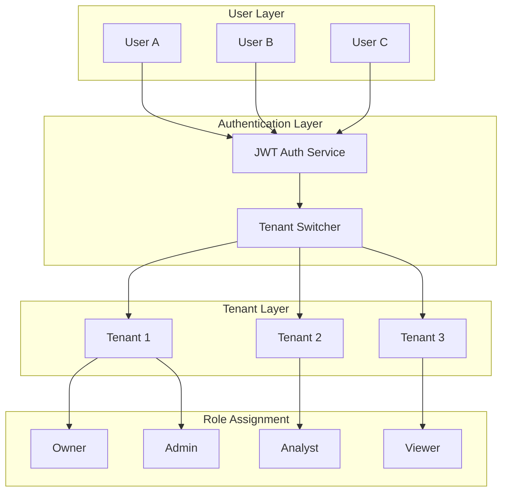
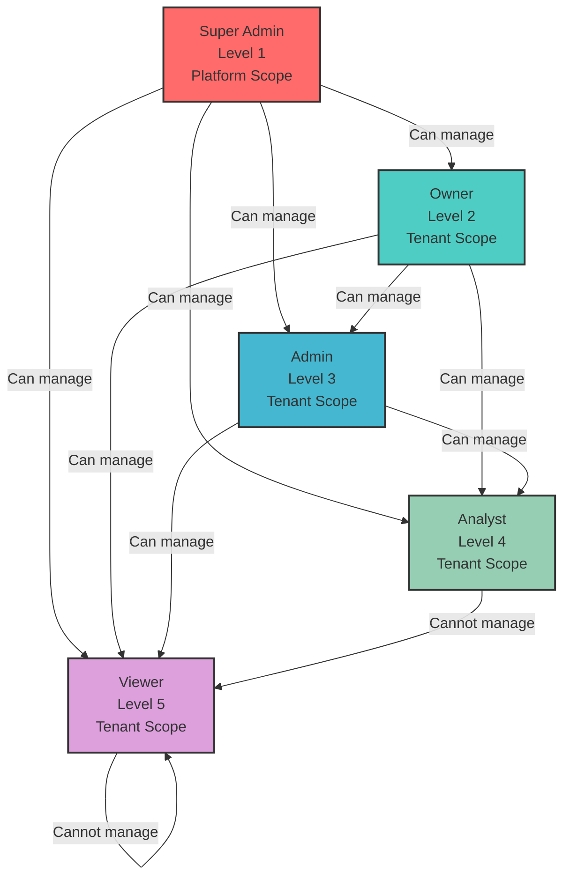
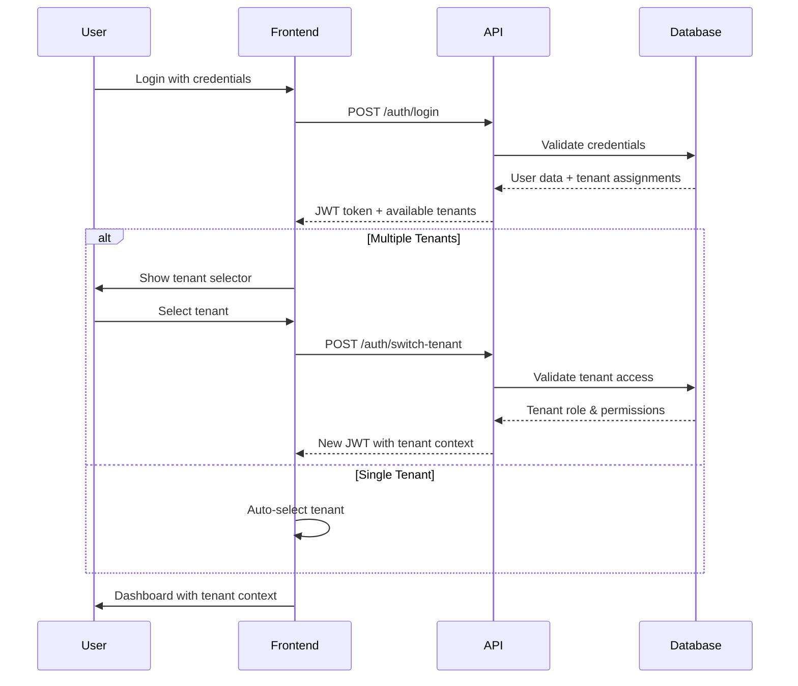
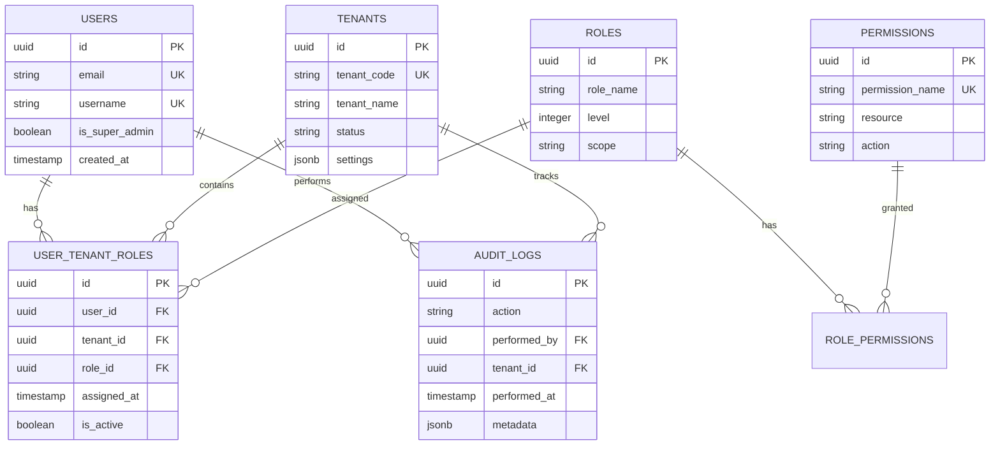
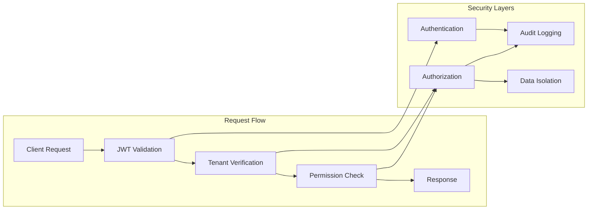
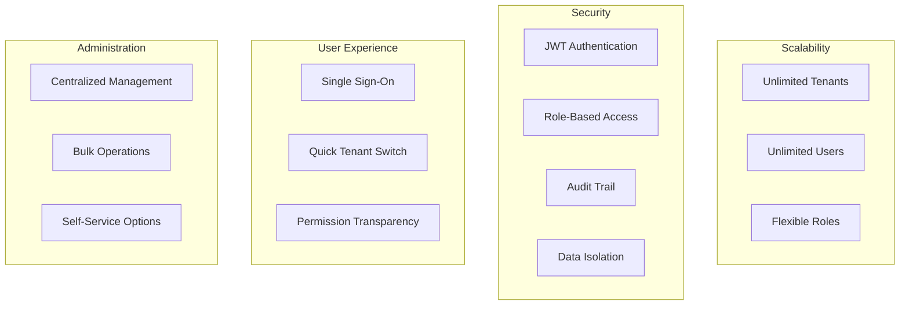

# Multi-Tenant RBAC System Documentation

## 🎯 Overview

A comprehensive Role-Based Access Control (RBAC) system enabling users to access multiple tenants with different roles and permissions. This documentation provides complete architectural design, workflows, and implementation guidance for a secure multi-tenant environment.

## 🏗️ System Architecture

## 📊 Role Hierarchy Visualization

## 🔄 Multi-Tenant User Flow

## 📁 Documentation Map

### 🎯 Core Concepts & Design

#### **[RBAC_ROLE_HIERARCHY.md](./RBAC_ROLE_HIERARCHY.md)**
Complete role hierarchy system with:
- 5-level role structure definition
- Permission matrix for all roles
- Role assignment rules and restrictions
- Database schema for roles and permissions
- Security considerations for privilege escalation

#### **[EXECUTIVE_SUMMARY.md](./EXECUTIVE_SUMMARY.md)**
High-level overview including:
- System benefits and ROI analysis
- Consolidated workflows and tables
- Implementation timeline and costs
- Risk mitigation strategies
- Success metrics

### 🔄 Workflow Documentation

#### **[TENANT_SWITCHING_WORKFLOW.md](./TENANT_SWITCHING_WORKFLOW.md)**
Detailed tenant switching implementation:
- JWT token structure with tenant context
- API endpoints for tenant operations
- Frontend tenant switcher components
- Session management strategies
- Security considerations for data isolation

#### **[USER_CREATION_PERMISSIONS_WORKFLOW.md](./USER_CREATION_PERMISSIONS_WORKFLOW.md)**
User management permission system:
- Who can create which users
- Role assignment restrictions
- Bulk user creation processes
- User invitation workflows
- Audit requirements

#### **[TENANT_MANAGEMENT_PERMISSIONS_WORKFLOW.md](./TENANT_MANAGEMENT_PERMISSIONS_WORKFLOW.md)**
Tenant lifecycle management:
- Tenant creation (Super Admin only)
- Settings management by role
- Tenant deletion safeguards
- Billing and subscription handling
- Feature flag management

### 🛠️ Technical Implementation

#### **[IMPLEMENTATION_GUIDE.md](./IMPLEMENTATION_GUIDE.md)**
Complete technical roadmap with:
- Database schema and migrations
- Backend service architecture
- Frontend component structure
- Testing strategies
- Deployment checklist

## 🗄️ Data Model Overview

## 🔒 Security Architecture

## 📊 Permission Matrix Overview

| Feature | Super Admin | Owner | Admin | Analyst | Viewer |
|---------|------------|-------|-------|---------|--------|
| **Platform Management** |
| Create Tenants | ✅ | ❌ | ❌ | ❌ | ❌ |
| Manage All Users | ✅ | ❌ | ❌ | ❌ | ❌ |
| **Tenant Management** |
| Modify Tenant Settings | ✅ | ✅ | ❌ | ❌ | ❌ |
| Delete Tenant | ✅ | ✅* | ❌ | ❌ | ❌ |
| **User Management** |
| Create Users | ✅ | ✅ | ✅ | ❌ | ❌ |
| Assign Roles | ✅ | ✅** | ✅** | ❌ | ❌ |
| **Data Operations** |
| View Data | ✅ | ✅ | ✅ | ✅ | ✅ |
| Modify Data | ✅ | ✅ | ✅ | ❌ | ❌ |
| Export Data | ✅ | ✅ | ✅ | ✅ | ❌ |

\* Only own tenant  
\** Only roles below their level

## 🎨 Key Design Principles

### 1. **Hierarchical Role System**
- Roles have numeric levels (1-5)
- Users can only assign roles below their level
- Permissions cascade down the hierarchy

### 2. **Tenant Isolation**
- Complete data separation between tenants
- No cross-tenant data access (except Super Admin)
- Tenant context required for all operations

### 3. **Flexible User Assignment**
- Users can belong to multiple tenants
- Different roles in different tenants
- Seamless switching between tenants

### 4. **Comprehensive Auditing**
- All actions logged with full context
- Immutable audit trail
- Compliance-ready reporting

## 🚀 Quick Navigation

### For Executives & Managers
1. Start with **[EXECUTIVE_SUMMARY.md](./EXECUTIVE_SUMMARY.md)** for business overview
2. Review **[RBAC_ROLE_HIERARCHY.md](./RBAC_ROLE_HIERARCHY.md)** for permission structure

### For Developers
1. Begin with **[IMPLEMENTATION_GUIDE.md](./IMPLEMENTATION_GUIDE.md)** for technical details
2. Reference workflow documents for specific features
3. Use this README for architecture understanding

### For System Administrators
1. Focus on **[USER_CREATION_PERMISSIONS_WORKFLOW.md](./USER_CREATION_PERMISSIONS_WORKFLOW.md)**
2. Study **[TENANT_MANAGEMENT_PERMISSIONS_WORKFLOW.md](./TENANT_MANAGEMENT_PERMISSIONS_WORKFLOW.md)**
3. Understand **[TENANT_SWITCHING_WORKFLOW.md](./TENANT_SWITCHING_WORKFLOW.md)**

## 📈 System Capabilities

## 📋 Feature Comparison

| Feature | Current System | New Multi-Tenant RBAC |
|---------|---------------|----------------------|
| User-Tenant Relationship | 1:1 | 1:Many |
| Role Assignment | Global | Per Tenant |
| Tenant Switching | Re-login Required | Seamless |
| Permission Granularity | Basic | Detailed |
| Audit Trail | Limited | Comprehensive |
| Data Isolation | Basic | Complete |

## 🔗 Related Resources

- **Database Schema**: See [IMPLEMENTATION_GUIDE.md](./IMPLEMENTATION_GUIDE.md#phase-1-database-schema-implementation)
- **API Specifications**: Check individual workflow documents
- **Security Details**: Review [TENANT_SWITCHING_WORKFLOW.md](./TENANT_SWITCHING_WORKFLOW.md#security-considerations)
- **Testing Strategies**: See [IMPLEMENTATION_GUIDE.md](./IMPLEMENTATION_GUIDE.md#phase-4-testing-strategy)

---

**Documentation Version**: 1.0  
**Last Updated**: January 2025  
**Status**: Ready for Implementation  
**Contact**: Development Team