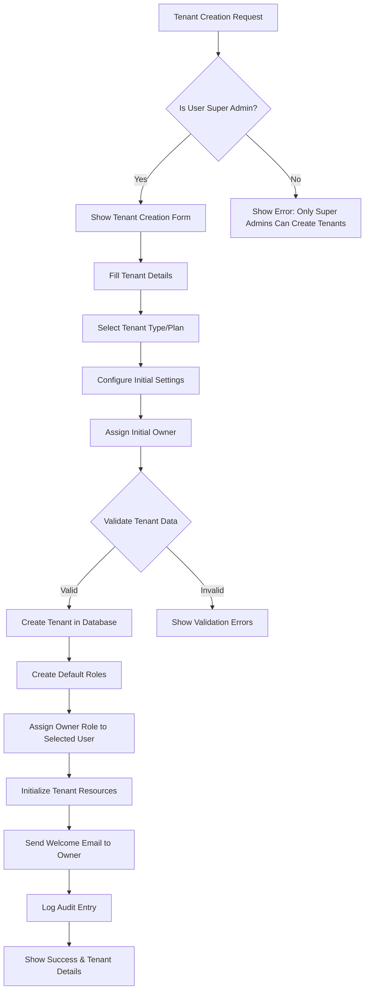

# Tenant Management Permissions Workflow

## Overview
This document defines who can create, modify, and delete tenants in the multi-tenant RBAC system.

## Tenant Management Permission Matrix

| Action | Super Admin | Owner | Admin | Analyst | Viewer |
|--------|------------|-------|-------|---------|--------|
| Create Tenant | ✓ | ✗ | ✗ | ✗ | ✗ |
| Update Tenant Settings | ✓ | ✓* | ✗ | ✗ | ✗ |
| Delete Tenant | ✓ | ✓* | ✗ | ✗ | ✗ |
| View Tenant Details | ✓ | ✓ | ✓ | ✓ | ✓ |
| Manage Tenant Billing | ✓ | ✓ | ✗ | ✗ | ✗ |
| Configure Integrations | ✓ | ✓ | ✓ | ✗ | ✗ |
| Manage Data Sources | ✓ | ✓ | ✓ | ✗ | ✗ |

\* Only for tenants where they have Owner role

## Tenant Creation Workflow



## Implementation Details

### 1. Tenant Creation API

```typescript
POST /api/tenants
Headers: {
  Authorization: Bearer <super-admin-token>
}
Request Body: {
  // Tenant basic info
  tenantName: string;
  tenantCode: string; // Unique identifier
  description?: string;
  
  // Tenant configuration
  config: {
    region: string;
    timezone: string;
    dateFormat: string;
    language: string;
  };
  
  // Billing information
  billing: {
    plan: 'starter' | 'professional' | 'enterprise';
    billingEmail: string;
    billingAddress?: Address;
  };
  
  // Initial owner assignment
  initialOwner: {
    userId?: string; // Existing user
    // OR create new user
    email?: string;
    firstName?: string;
    lastName?: string;
  };
  
  // Feature flags
  features: {
    maxUsers: number;
    maxDataSources: number;
    enableAdvancedAnalytics: boolean;
    enableCustomBranding: boolean;
  };
}

Response: {
  success: boolean;
  tenant: {
    id: string;
    tenantCode: string;
    tenantName: string;
    status: 'active' | 'pending' | 'suspended';
    createdAt: Date;
    owner: User;
    config: TenantConfig;
    features: TenantFeatures;
  };
}
```

### 2. Tenant Management Service

```typescript
class TenantManagementService {
  async createTenant(
    creatorContext: UserContext,
    tenantData: CreateTenantDto
  ): Promise<Tenant> {
    // Step 1: Verify creator is Super Admin
    if (creatorContext.role.level !== 1) {
      throw new ForbiddenException('Only Super Admins can create tenants');
    }
    
    // Step 2: Validate tenant code uniqueness
    const existingTenant = await this.findByCode(tenantData.tenantCode);
    if (existingTenant) {
      throw new ConflictException('Tenant code already exists');
    }
    
    // Step 3: Create tenant
    const tenant = await this.tenantRepository.create({
      ...tenantData,
      status: 'active',
      createdBy: creatorContext.userId
    });
    
    // Step 4: Initialize default roles for tenant
    await this.initializeTenantRoles(tenant.id);
    
    // Step 5: Assign initial owner
    const owner = await this.assignInitialOwner(
      tenant.id,
      tenantData.initialOwner
    );
    
    // Step 6: Initialize tenant resources
    await this.initializeTenantResources(tenant);
    
    // Step 7: Create audit log
    await this.auditLog.create({
      action: 'TENANT_CREATED',
      performedBy: creatorContext.userId,
      targetTenant: tenant.id,
      metadata: {
        plan: tenantData.billing.plan,
        initialOwner: owner.id
      }
    });
    
    // Step 8: Send notifications
    await this.notificationService.sendTenantCreatedNotifications(
      tenant,
      owner
    );
    
    return tenant;
  }
  
  private async initializeTenantRoles(tenantId: string): Promise<void> {
    // Create default roles for the tenant
    const defaultRoles = [
      { name: 'Owner', level: 2, scope: 'tenant' },
      { name: 'Admin', level: 3, scope: 'tenant' },
      { name: 'Analyst', level: 4, scope: 'tenant' },
      { name: 'Viewer', level: 5, scope: 'tenant' }
    ];
    
    for (const roleData of defaultRoles) {
      await this.roleService.createTenantRole(tenantId, roleData);
    }
  }
  
  private async initializeTenantResources(tenant: Tenant): Promise<void> {
    // Create default dashboard
    await this.dashboardService.createDefaultDashboard(tenant.id);
    
    // Initialize storage buckets
    await this.storageService.initializeTenantStorage(tenant.id);
    
    // Set up default integrations
    await this.integrationService.setupDefaultIntegrations(tenant.id);
  }
}
```

### 3. Tenant Update Permissions

```typescript
class TenantUpdateService {
  async updateTenant(
    userContext: TenantContext,
    tenantId: string,
    updates: UpdateTenantDto
  ): Promise<Tenant> {
    // Check if user can update this tenant
    const canUpdate = await this.checkUpdatePermission(
      userContext,
      tenantId,
      updates
    );
    
    if (!canUpdate) {
      throw new ForbiddenException('Insufficient permissions to update tenant');
    }
    
    // Apply updates based on user role
    const allowedUpdates = this.filterAllowedUpdates(
      userContext.role,
      updates
    );
    
    // Update tenant
    const updatedTenant = await this.tenantRepository.update(
      tenantId,
      allowedUpdates
    );
    
    // Audit log
    await this.auditLog.create({
      action: 'TENANT_UPDATED',
      performedBy: userContext.userId,
      targetTenant: tenantId,
      changes: allowedUpdates
    });
    
    return updatedTenant;
  }
  
  private async checkUpdatePermission(
    userContext: TenantContext,
    tenantId: string,
    updates: UpdateTenantDto
  ): Promise<boolean> {
    // Super Admin can update any tenant
    if (userContext.role.level === 1) return true;
    
    // Owner can update their own tenant
    if (userContext.role.level === 2 && userContext.tenantId === tenantId) {
      // Check if trying to update restricted fields
      const restrictedFields = ['tenantCode', 'billing.plan'];
      const hasRestrictedUpdates = restrictedFields.some(
        field => updates[field] !== undefined
      );
      
      return !hasRestrictedUpdates;
    }
    
    return false;
  }
  
  private filterAllowedUpdates(role: Role, updates: UpdateTenantDto): any {
    // Define what each role can update
    const allowedFieldsByRole = {
      1: ['*'], // Super Admin - all fields
      2: ['tenantName', 'description', 'config', 'features'], // Owner
      3: ['config.timezone', 'config.dateFormat'], // Admin
    };
    
    const allowedFields = allowedFieldsByRole[role.level] || [];
    
    if (allowedFields.includes('*')) {
      return updates;
    }
    
    // Filter updates to only allowed fields
    return Object.keys(updates)
      .filter(key => allowedFields.includes(key))
      .reduce((obj, key) => {
        obj[key] = updates[key];
        return obj;
      }, {});
  }
}
```

### 4. Tenant Deletion Workflow

```typescript
class TenantDeletionService {
  async deleteTenant(
    userContext: TenantContext,
    tenantId: string,
    confirmation: TenantDeletionConfirmation
  ): Promise<void> {
    // Step 1: Verify permissions
    const canDelete = await this.checkDeletePermission(userContext, tenantId);
    if (!canDelete) {
      throw new ForbiddenException('Insufficient permissions to delete tenant');
    }
    
    // Step 2: Validate confirmation
    if (!this.validateDeletionConfirmation(confirmation, tenantId)) {
      throw new BadRequestException('Invalid deletion confirmation');
    }
    
    // Step 3: Check tenant can be deleted
    await this.validateTenantDeletable(tenantId);
    
    // Step 4: Start deletion process
    await this.performTenantDeletion(tenantId, userContext);
  }
  
  private async checkDeletePermission(
    userContext: TenantContext,
    tenantId: string
  ): Promise<boolean> {
    // Super Admin can delete any tenant
    if (userContext.role.level === 1) return true;
    
    // Owner can delete their own tenant (with restrictions)
    if (userContext.role.level === 2 && userContext.tenantId === tenantId) {
      // Additional checks for owner deletion
      const tenant = await this.tenantRepository.findById(tenantId);
      
      // Cannot delete if there are active subscriptions
      if (tenant.billing.status === 'active') {
        throw new BadRequestException(
          'Cannot delete tenant with active subscription'
        );
      }
      
      return true;
    }
    
    return false;
  }
  
  private async validateTenantDeletable(tenantId: string): Promise<void> {
    // Check for active users
    const activeUsers = await this.userService.countActiveUsersInTenant(tenantId);
    if (activeUsers > 1) {
      throw new BadRequestException(
        'Cannot delete tenant with active users. Deactivate all users first.'
      );
    }
    
    // Check for active integrations
    const activeIntegrations = await this.integrationService
      .countActiveIntegrations(tenantId);
    if (activeIntegrations > 0) {
      throw new BadRequestException(
        'Cannot delete tenant with active integrations'
      );
    }
  }
  
  private async performTenantDeletion(
    tenantId: string,
    userContext: TenantContext
  ): Promise<void> {
    // Soft delete first
    await this.tenantRepository.update(tenantId, {
      status: 'pending_deletion',
      deletionRequestedAt: new Date(),
      deletionRequestedBy: userContext.userId
    });
    
    // Schedule hard deletion after grace period (30 days)
    await this.jobQueue.schedule('tenant-deletion', {
      tenantId,
      executeAt: addDays(new Date(), 30)
    });
    
    // Archive data
    await this.archiveService.archiveTenantData(tenantId);
    
    // Notify stakeholders
    await this.notificationService.notifyTenantDeletion(tenantId);
    
    // Audit log
    await this.auditLog.create({
      action: 'TENANT_DELETION_REQUESTED',
      performedBy: userContext.userId,
      targetTenant: tenantId,
      metadata: {
        scheduledDeletionDate: addDays(new Date(), 30)
      }
    });
  }
}
```

### 5. Tenant Settings Management

```typescript
interface TenantSettings {
  general: {
    tenantName: string;
    description: string;
    logo?: string;
    primaryColor?: string;
  };
  
  security: {
    passwordPolicy: PasswordPolicy;
    mfaRequired: boolean;
    ipWhitelist: string[];
    sessionTimeout: number;
  };
  
  integrations: {
    slack?: SlackIntegration;
    email?: EmailIntegration;
    sso?: SSOConfiguration;
  };
  
  features: {
    [key: string]: boolean | number;
  };
}

class TenantSettingsService {
  async updateSettings(
    userContext: TenantContext,
    tenantId: string,
    section: keyof TenantSettings,
    settings: any
  ): Promise<void> {
    // Check permission for specific section
    const canUpdate = this.checkSettingsPermission(
      userContext.role,
      section
    );
    
    if (!canUpdate) {
      throw new ForbiddenException(
        `No permission to update ${section} settings`
      );
    }
    
    // Validate settings
    await this.validateSettings(section, settings);
    
    // Update settings
    await this.tenantRepository.updateSettings(tenantId, section, settings);
    
    // Some settings require immediate action
    if (section === 'security') {
      await this.applySecuritySettings(tenantId, settings);
    }
  }
  
  private checkSettingsPermission(
    role: Role,
    section: keyof TenantSettings
  ): boolean {
    const permissions = {
      general: [1, 2], // Super Admin, Owner
      security: [1, 2], // Super Admin, Owner
      integrations: [1, 2, 3], // Super Admin, Owner, Admin
      features: [1], // Super Admin only
    };
    
    return permissions[section]?.includes(role.level) || false;
  }
}
```

### 6. Tenant Billing Management

```typescript
interface TenantBilling {
  plan: 'starter' | 'professional' | 'enterprise';
  status: 'active' | 'past_due' | 'cancelled';
  currentPeriod: {
    start: Date;
    end: Date;
  };
  usage: {
    users: number;
    dataSources: number;
    storage: number; // in GB
  };
  limits: {
    maxUsers: number;
    maxDataSources: number;
    maxStorage: number;
  };
}

class TenantBillingService {
  async upgradePlan(
    userContext: TenantContext,
    tenantId: string,
    newPlan: string
  ): Promise<void> {
    // Only Super Admin or Owner can change billing
    if (userContext.role.level > 2) {
      throw new ForbiddenException('No permission to change billing plan');
    }
    
    // Validate plan upgrade
    const currentPlan = await this.getCurrentPlan(tenantId);
    if (!this.isValidUpgrade(currentPlan, newPlan)) {
      throw new BadRequestException('Invalid plan upgrade');
    }
    
    // Process upgrade
    await this.processUpgrade(tenantId, newPlan);
    
    // Update limits
    await this.updateTenantLimits(tenantId, newPlan);
    
    // Audit
    await this.auditLog.create({
      action: 'TENANT_PLAN_UPGRADED',
      performedBy: userContext.userId,
      targetTenant: tenantId,
      metadata: {
        fromPlan: currentPlan,
        toPlan: newPlan
      }
    });
  }
}
```

## Security Considerations

### 1. Tenant Isolation
- Ensure complete data isolation between tenants
- Validate tenant ID in every request
- Use row-level security in database

### 2. Permission Boundaries
- Never allow cross-tenant operations except for Super Admin
- Validate all tenant-scoped operations
- Implement rate limiting per tenant

### 3. Audit Requirements
All tenant operations must be logged:
- Who performed the action
- What action was performed
- When it happened
- What changed
- Why (if provided)

### 4. Data Protection
- Encrypt tenant-specific encryption keys
- Separate backups per tenant
- Implement data retention policies
- Support data export for compliance