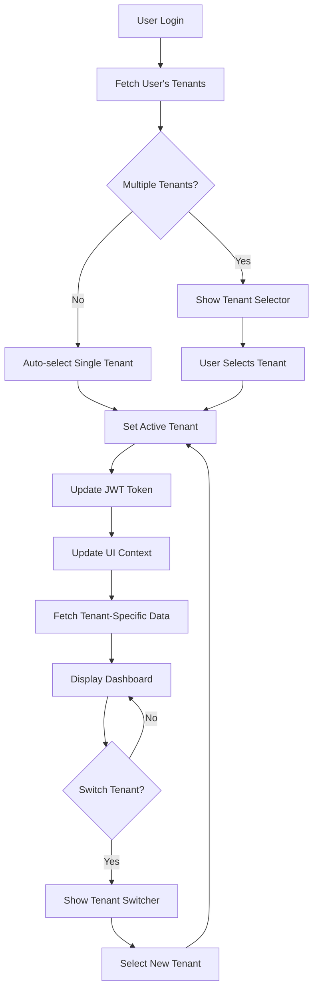

# Tenant Switching Workflow

## Overview
This document outlines the complete workflow for implementing multi-tenant switching functionality where users can be assigned to multiple tenants and switch between them seamlessly.

## Core Concepts

### 1. User-Tenant Relationship
- Users can be assigned to multiple tenants
- Each user-tenant relationship has an associated role
- Roles are scoped to specific tenants (a user can be Admin in Tenant A but Analyst in Tenant B)

### 2. Tenant Switching Flow



## Implementation Steps

### 1. Backend Implementation

#### A. Database Schema Updates
```sql
-- User-Tenant-Roles Mapping Table
CREATE TABLE user_tenant_roles (
    id UUID PRIMARY KEY,
    user_id UUID NOT NULL,
    tenant_id UUID NOT NULL,
    role_id UUID NOT NULL,
    assigned_at TIMESTAMP DEFAULT CURRENT_TIMESTAMP,
    assigned_by UUID,
    is_active BOOLEAN DEFAULT true,
    FOREIGN KEY (user_id) REFERENCES users(id),
    FOREIGN KEY (tenant_id) REFERENCES tenants(id),
    FOREIGN KEY (role_id) REFERENCES roles(id),
    UNIQUE(user_id, tenant_id, role_id)
);

-- Add current tenant to user sessions
ALTER TABLE user_sessions ADD COLUMN current_tenant_id UUID;
```

#### B. API Endpoints

##### 1. Get User's Tenants
```typescript
GET /api/users/me/tenants
Response: {
  tenants: [
    {
      tenantId: string,
      tenantName: string,
      role: {
        roleId: string,
        roleName: string,
        permissions: string[]
      },
      isCurrentTenant: boolean
    }
  ],
  currentTenantId: string
}
```

##### 2. Switch Tenant
```typescript
POST /api/users/me/switch-tenant
Request: {
  tenantId: string
}
Response: {
  success: boolean,
  newToken: string, // JWT with updated tenant context
  tenant: {
    tenantId: string,
    tenantName: string,
    role: Role,
    permissions: string[]
  }
}
```

### 2. Frontend Implementation

#### A. Enhanced Auth Context
```typescript
interface AuthContextType {
  user: User | null;
  currentTenant: TenantContext | null;
  availableTenants: TenantAssignment[];
  switchTenant: (tenantId: string) => Promise<void>;
  refreshTenants: () => Promise<void>;
  // ... existing auth methods
}

interface TenantContext {
  tenantId: string;
  tenantName: string;
  role: Role;
  permissions: string[];
}

interface TenantAssignment {
  tenant: Tenant;
  role: Role;
  assignedAt: Date;
}
```

#### B. Tenant Switcher Component
```typescript
// components/TenantSwitcher.tsx
const TenantSwitcher = () => {
  const { currentTenant, availableTenants, switchTenant } = useAuth();
  
  return (
    <DropdownMenu>
      <DropdownMenuTrigger>
        <div className="flex items-center gap-2">
          <Building2 className="h-4 w-4" />
          <span>{currentTenant?.tenantName}</span>
          <ChevronDown className="h-4 w-4" />
        </div>
      </DropdownMenuTrigger>
      <DropdownMenuContent>
        {availableTenants.map((assignment) => (
          <DropdownMenuItem
            key={assignment.tenant.tenantId}
            onClick={() => switchTenant(assignment.tenant.tenantId)}
          >
            <div className="flex flex-col">
              <span>{assignment.tenant.tenantName}</span>
              <span className="text-xs text-gray-500">
                {assignment.role.displayRoleName}
              </span>
            </div>
          </DropdownMenuItem>
        ))}
      </DropdownMenuContent>
    </DropdownMenu>
  );
};
```

### 3. JWT Token Structure

#### Enhanced JWT Payload
```typescript
interface JWTPayload {
  // User info
  userId: string;
  username: string;
  email: string;
  
  // Current tenant context
  currentTenant: {
    tenantId: string;
    tenantName: string;
    role: {
      roleId: string;
      roleName: string;
    };
    permissions: string[];
  };
  
  // Available tenants (lightweight)
  availableTenants: string[]; // Just tenant IDs
  
  // Token metadata
  iat: number;
  exp: number;
}
```

### 4. Middleware & Guards

#### A. Tenant-Aware Middleware
```typescript
// middleware/tenantMiddleware.ts
export const tenantMiddleware = async (req, res, next) => {
  const token = req.headers.authorization;
  const decoded = verifyToken(token);
  
  // Verify user has access to current tenant
  const hasAccess = await checkUserTenantAccess(
    decoded.userId, 
    decoded.currentTenant.tenantId
  );
  
  if (!hasAccess) {
    return res.status(403).json({ error: 'No access to this tenant' });
  }
  
  // Attach tenant context to request
  req.tenantContext = {
    tenantId: decoded.currentTenant.tenantId,
    userId: decoded.userId,
    role: decoded.currentTenant.role,
    permissions: decoded.currentTenant.permissions
  };
  
  next();
};
```

#### B. Permission Guards
```typescript
// guards/permissionGuard.ts
export const requirePermission = (permission: string) => {
  return (req, res, next) => {
    const { permissions } = req.tenantContext;
    
    if (!permissions.includes(permission)) {
      return res.status(403).json({ 
        error: 'Insufficient permissions',
        required: permission 
      });
    }
    
    next();
  };
};
```

### 5. Data Isolation

#### A. Tenant-Scoped Queries
```typescript
// All database queries should be tenant-scoped
class DataService {
  async getConnectors(tenantId: string) {
    return db.connectors.findMany({
      where: { tenantId }
    });
  }
  
  async createUser(userData: CreateUserDto, tenantContext: TenantContext) {
    // Verify creator has permission in this tenant
    if (!tenantContext.permissions.includes('CREATE_USER')) {
      throw new ForbiddenException();
    }
    
    return db.users.create({
      data: {
        ...userData,
        createdInTenant: tenantContext.tenantId,
        createdBy: tenantContext.userId
      }
    });
  }
}
```

### 6. UI State Management

#### A. Tenant-Aware State
```typescript
// hooks/useTenantData.ts
export const useTenantData = () => {
  const { currentTenant } = useAuth();
  
  // Reset data when tenant changes
  useEffect(() => {
    // Clear cached data
    queryClient.removeQueries();
    
    // Fetch new tenant data
    if (currentTenant) {
      queryClient.prefetchQuery(['tenant', currentTenant.tenantId]);
    }
  }, [currentTenant?.tenantId]);
  
  return {
    tenantId: currentTenant?.tenantId,
    isLoading: !currentTenant
  };
};
```

### 7. Security Considerations

1. **Token Refresh on Switch**: Always issue a new JWT when switching tenants
2. **Permission Verification**: Verify permissions on both frontend and backend
3. **Audit Trail**: Log all tenant switches for security auditing
4. **Session Management**: Clear tenant-specific cache on switch
5. **Cross-Tenant Data Leak Prevention**: Ensure complete data isolation

### 8. User Experience

1. **Persistent Selection**: Remember last selected tenant per user
2. **Quick Switcher**: Keyboard shortcut (Cmd/Ctrl + K) for tenant switching
3. **Visual Indicators**: Clear indication of current tenant in UI
4. **Loading States**: Show loading when switching tenants
5. **Error Handling**: Graceful handling of tenant access errors

## Testing Scenarios

1. **Single Tenant User**: Auto-selection works correctly
2. **Multi-Tenant User**: Can see and switch between assigned tenants
3. **Permission Changes**: Updates reflect after tenant switch
4. **Token Expiry**: Handles token refresh during tenant operations
5. **Concurrent Sessions**: Multiple browser sessions handle tenant switching
6. **Revoked Access**: User removed from tenant cannot access it