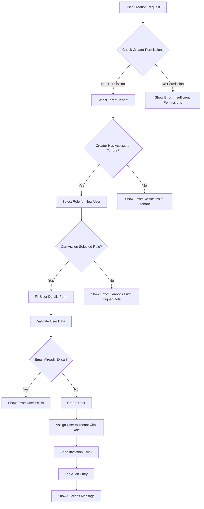

# User Creation Permissions Workflow

## Overview
This document defines the complete workflow for user creation with proper RBAC permissions in a multi-tenant environment.

## User Creation Permission Matrix

### Who Can Create Users?

| Creator Role | Can Create | Target Roles Allowed | Scope |
|--------------|------------|---------------------|--------|
| Super Admin | Yes | All roles | Any tenant |
| Owner | Yes | Admin, Analyst, Viewer | Own tenant(s) |
| Admin | Yes | Analyst, Viewer | Own tenant(s) |
| Analyst | No | - | - |
| Viewer | No | - | - |

## User Creation Workflow



## Implementation Details

### 1. API Endpoint for User Creation

```typescript
POST /api/users
Headers: {
  Authorization: Bearer <token>
}
Request Body: {
  // User details
  email: string;
  firstName: string;
  lastName: string;
  
  // Tenant assignment
  tenantAssignments: [{
    tenantId: string;
    roleId: string;
  }];
  
  // Optional
  sendInvite: boolean; // default true
  customMessage?: string; // for invite email
}

Response: {
  success: boolean;
  user: {
    id: string;
    email: string;
    firstName: string;
    lastName: string;
    status: 'pending' | 'active';
    tenantAssignments: [{
      tenant: Tenant;
      role: Role;
    }];
  };
  inviteSent: boolean;
}
```

### 2. Backend Permission Validation

```typescript
class UserCreationService {
  async createUser(
    creatorContext: TenantContext,
    userData: CreateUserDto
  ): Promise<User> {
    // Step 1: Validate creator has user creation permission
    if (!creatorContext.permissions.includes('USER_CREATE')) {
      throw new ForbiddenException('No permission to create users');
    }
    
    // Step 2: Validate tenant assignments
    for (const assignment of userData.tenantAssignments) {
      // Check creator has access to target tenant
      const hasAccess = await this.validateTenantAccess(
        creatorContext.userId,
        assignment.tenantId
      );
      
      if (!hasAccess) {
        throw new ForbiddenException(
          `No access to tenant: ${assignment.tenantId}`
        );
      }
      
      // Check role assignment permission
      const canAssignRole = await this.validateRoleAssignment(
        creatorContext.role,
        assignment.roleId
      );
      
      if (!canAssignRole) {
        throw new ForbiddenException(
          `Cannot assign role: ${assignment.roleId}`
        );
      }
    }
    
    // Step 3: Check if user already exists
    const existingUser = await this.findUserByEmail(userData.email);
    if (existingUser) {
      // Handle existing user case
      return this.addUserToTenants(existingUser, userData.tenantAssignments);
    }
    
    // Step 4: Create new user
    const user = await this.createNewUser(userData);
    
    // Step 5: Create audit log
    await this.auditLog.create({
      action: 'USER_CREATED',
      performedBy: creatorContext.userId,
      targetUser: user.id,
      tenants: userData.tenantAssignments.map(a => a.tenantId),
      metadata: {
        creatorRole: creatorContext.role.roleName,
        assignedRoles: userData.tenantAssignments
      }
    });
    
    return user;
  }
  
  private async validateRoleAssignment(
    creatorRole: Role,
    targetRoleId: string
  ): Promise<boolean> {
    const targetRole = await this.roleService.findById(targetRoleId);
    
    // Creator can only assign roles at or below their level
    return creatorRole.level < targetRole.level;
  }
}
```

### 3. Frontend User Creation Form

```typescript
// components/UserCreationForm.tsx
const UserCreationForm = () => {
  const { currentUser, currentTenant } = useAuth();
  const [tenantAssignments, setTenantAssignments] = useState([{
    tenantId: currentTenant.tenantId,
    roleId: ''
  }]);
  
  // Fetch available roles based on current user's role
  const { data: availableRoles } = useQuery(
    ['availableRoles', currentUser.role.level],
    () => fetchAssignableRoles(currentUser.role.level)
  );
  
  // Fetch tenants user can assign to
  const { data: availableTenants } = useQuery(
    ['availableTenants'],
    () => fetchUserTenants()
  );
  
  const handleSubmit = async (formData) => {
    try {
      const response = await createUser({
        ...formData,
        tenantAssignments
      });
      
      toast.success('User created successfully');
      
      // Send invite if requested
      if (formData.sendInvite) {
        await sendUserInvite(response.user.id);
      }
    } catch (error) {
      toast.error(error.message);
    }
  };
  
  return (
    <form onSubmit={handleSubmit}>
      {/* User details fields */}
      
      {/* Tenant assignments */}
      <div className="space-y-4">
        <h3>Tenant Assignments</h3>
        {tenantAssignments.map((assignment, index) => (
          <div key={index} className="flex gap-4">
            <Select
              value={assignment.tenantId}
              onChange={(value) => updateAssignment(index, 'tenantId', value)}
            >
              {availableTenants?.map(tenant => (
                <SelectItem key={tenant.id} value={tenant.id}>
                  {tenant.name}
                </SelectItem>
              ))}
            </Select>
            
            <Select
              value={assignment.roleId}
              onChange={(value) => updateAssignment(index, 'roleId', value)}
            >
              {availableRoles?.map(role => (
                <SelectItem key={role.id} value={role.id}>
                  {role.displayName}
                </SelectItem>
              ))}
            </Select>
            
            {tenantAssignments.length > 1 && (
              <Button
                type="button"
                variant="ghost"
                onClick={() => removeAssignment(index)}
              >
                Remove
              </Button>
            )}
          </div>
        ))}
        
        <Button
          type="button"
          variant="outline"
          onClick={addAssignment}
        >
          Add Another Tenant
        </Button>
      </div>
      
      <Button type="submit">Create User</Button>
    </form>
  );
};
```

### 4. Special Cases

#### A. Adding Existing User to New Tenant
```typescript
async function addExistingUserToTenant(
  userId: string,
  tenantId: string,
  roleId: string,
  creatorContext: TenantContext
): Promise<void> {
  // Validate permissions
  if (!await canAssignUserToTenant(creatorContext, tenantId, roleId)) {
    throw new ForbiddenException();
  }
  
  // Check if user already in tenant
  const existingAssignment = await getUserTenantRole(userId, tenantId);
  if (existingAssignment) {
    throw new ConflictException('User already assigned to this tenant');
  }
  
  // Add user to tenant
  await createUserTenantRole(userId, tenantId, roleId);
  
  // Notify user
  await sendTenantInvitationEmail(userId, tenantId);
}
```

#### B. Bulk User Creation
```typescript
interface BulkUserCreation {
  users: CreateUserDto[];
  defaultTenantId: string;
  defaultRoleId: string;
  skipExisting: boolean;
}

async function bulkCreateUsers(
  data: BulkUserCreation,
  creatorContext: TenantContext
): Promise<BulkCreationResult> {
  const results = {
    created: [],
    skipped: [],
    failed: []
  };
  
  // Validate default assignments once
  if (!await canAssignToTenant(creatorContext, data.defaultTenantId, data.defaultRoleId)) {
    throw new ForbiddenException();
  }
  
  for (const userData of data.users) {
    try {
      const user = await createUser({
        ...userData,
        tenantAssignments: [{
          tenantId: data.defaultTenantId,
          roleId: data.defaultRoleId
        }]
      }, creatorContext);
      
      results.created.push(user);
    } catch (error) {
      if (error instanceof UserExistsError && data.skipExisting) {
        results.skipped.push({ email: userData.email, reason: 'exists' });
      } else {
        results.failed.push({ email: userData.email, error: error.message });
      }
    }
  }
  
  return results;
}
```

### 5. User Invitation Flow

```typescript
interface UserInvitation {
  id: string;
  userId: string;
  tenantId: string;
  roleId: string;
  invitedBy: string;
  invitedAt: Date;
  expiresAt: Date;
  acceptedAt?: Date;
  token: string;
}

async function sendUserInvite(
  userId: string,
  tenantAssignments: TenantAssignment[]
): Promise<void> {
  // Generate secure invitation token
  const invitations = await Promise.all(
    tenantAssignments.map(async (assignment) => {
      const token = generateSecureToken();
      
      return createInvitation({
        userId,
        tenantId: assignment.tenantId,
        roleId: assignment.roleId,
        token,
        expiresAt: addDays(new Date(), 7)
      });
    })
  );
  
  // Send email with invitation links
  await sendInvitationEmail(userId, invitations);
}
```

### 6. Audit and Compliance

```typescript
interface UserCreationAudit {
  id: string;
  action: 'USER_CREATED' | 'USER_INVITED' | 'USER_ADDED_TO_TENANT';
  performedBy: string;
  performedAt: Date;
  targetUser: string;
  details: {
    creatorRole: string;
    creatorTenant: string;
    assignedTenants: string[];
    assignedRoles: string[];
    invitationSent: boolean;
    ipAddress: string;
    userAgent: string;
  };
}

// Audit logging must capture:
// 1. Who created the user
// 2. What role they had
// 3. Which tenants/roles were assigned
// 4. When it happened
// 5. From where (IP, user agent)
```

## Error Handling

### Common Error Scenarios

1. **Insufficient Permissions**
   - Message: "You don't have permission to create users"
   - Action: Show permission requirements

2. **Cannot Assign Higher Role**
   - Message: "You cannot assign roles higher than your own"
   - Action: Show available roles only

3. **No Tenant Access**
   - Message: "You don't have access to the selected tenant"
   - Action: Filter tenant list to accessible ones

4. **User Already Exists**
   - Message: "A user with this email already exists"
   - Action: Offer to add to new tenant instead

5. **Invalid Email Domain**
   - Message: "Email domain not allowed for this tenant"
   - Action: Show allowed domains (if restricted)

## Security Best Practices

1. **Email Verification**: Always verify email ownership before activation
2. **Password Policy**: Enforce strong passwords on first login
3. **MFA Requirement**: Require MFA for admin roles
4. **Session Management**: Invalidate all sessions on role change
5. **Rate Limiting**: Limit user creation requests per hour
6. **Domain Restrictions**: Allow tenant-specific email domain restrictions